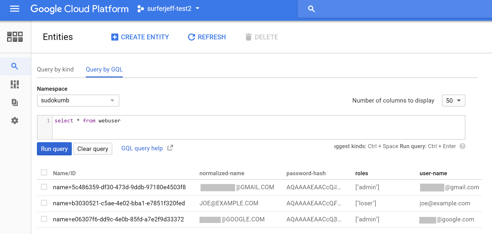

### <a name="datastore"> Sudokumb stores user info in Datastore.</a>

Sudokumb stores user information like email addresses and passwords in [Google Cloud Datastore](https://cloud.google.com/datastore/). To do so, it 
[implements](./DatastoreUserStore.cs) a 
[custom storage provider for identity](https://docs.microsoft.com/en-us/aspnet/core/security/authentication/identity-custom-storage-providers).

[Google Cloud Datastore](https://cloud.google.com/datastore/) is a fully managed, [NoSQL](https://en.wikipedia.org/wiki/NoSQL) database. Because it is fully managed, you never have to upgrade hardware or operating systems. There are no database instances for you to maintain. You only pay for the data you store, read, and write.

User data fits perfectly into [Google Cloud Datastore](https://cloud.google.com/datastore/), because user data is often read and rarely written.

