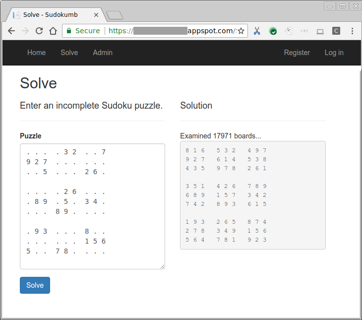

# Sudoku + Dumb = Sudokumb.

This is the companion sample for a number of [medium.com stories](https://medium.com/@SurferJeff).

**Sudokumb** is a [Sudoku](https://en.wikipedia.org/wiki/Sudoku) solver. In order to demonstrate some cool features of <a href="https://cloud.google.com/">Google Cloud Platform </a>,
Sudokumb solves the puzzles in a very dumb way.



## Smart

Most of what Sudokumb does is actually pretty smart.

###  Sudokumb stores user info in [Datastore](https://cloud.google.com/datastore/).

[Learn how](./DatastoreUserStore/README.md).

###  Sudokumb logs and reports errors and traces to [Stackdriver](https://cloud.google.com/dotnet/docs/stackdriver).

[Learn how](./Stackdriver.md).

###  Sudokumb secures forms and cookies with [Key Management Service](https://cloud.google.com/kms/)

[Learn how](./KmsDataProtectionProvider/README.md).

###  Sudokumb automatically scales on [App Engine](https://cloud.google.com/appengine/docs/flexible/dotnet/).

[Learn how](./AppEngine.md).

## Dumb

###  Sudokumb distributes tiny fragments of work via [Google Cloud Pub/Sub](https://cloud.google.com/pubsub/docs/)

[Learn how](./WebLib/PubSub.md).

# Building and Running

## Prerequisites

1.  **Follow the set-up instructions in [the documentation](https://cloud.google.com/dotnet/docs/setup).**

2.  Install the [.NET Core SDK, version 2.0](https://www.microsoft.com/net/download/dotnet-core/sdk-2.0.3).

3.  [Click here](https://console.cloud.google.com/flows/enableapi?apiid=datastore.googleapis.com&showconfirmation=true)
    to enable the Google Cloud Datastore API for your project.

4.  [Click here](https://console.cloud.google.com/flows/enableapi?apiid=pubsub.googleapis.com&showconfirmation=true)
    to enable the Google Stackdriver Cloud Pub/Sub API for your project.

5.  [Click here](https://console.cloud.google.com/flows/enableapi?apiid=cloudkms.googleapis.com&showconfirmation=true) 
    to enable Google Cloud Key Management Service for your project.


6.  Edit [`WebApp/appsettings.json`](WebApp/appsettings.json).

    Replace `YOUR-PROJECT-ID` with your Google project id.

7.  Edit [`WebSolver/appsettings.json`](WebSolver/appsettings.json).

    Replace `YOUR-PROJECT-ID` with your Google project id.

##  Using PowerShell

### Run Locally

1.	To run locally, run the WebApp and the WebSolver:
    ```powershell
    PS > dotnet run -p WebApp/WebApp.csproj
    Hosting environment: Production
    Content root path: /usr/local/google/home/<redacted>/gitrepos/dotnet-docs-samples/applications/sudokumb/WebApp
    Now listening on: http://localhost:5000
    Application started. Press Ctrl+C to shut down.
    ```

2.	In a separate window:
    ```powershell
    PS > $env:ASPNETCORE_URLS = 'http://localhost:5001'
    PS > dotnet run -p WebSolver/WebSolver.csproj
    Hosting environment: Production
    Content root path: /usr/local/google/home/<redacted>/gitrepos/dotnet-docs-samples/applications/sudokumb/WebSolver
    Now listening on: http://localhost:5001
    Application started. Press Ctrl+C to shut down.
    ```
### Deploy to App Engine

1.  Install the [Google Cloud SDK](http://cloud.google.com/sdk).

2.  [Click here](https://console.cloud.google.com/appengine) to create an
    App Engine Application.

3.  Run the script to add Kms Permissions to the App Engine service account:
    ```powershell
    PS> .\Add-KmsPermissionsToAppEngine
    ```
    
2.	Publish the projects:
    ```powershell
    PS > dotnet publish -c Release Sudokumb.sln
    ```

2.  Deploy WebApp with `gcloud`:
    ```powershell
    PS > gcloud beta app deploy WebApp/bin/Release/netcoreapp2.0/publish/app.yaml
    ```

3.  Deploy WebSolver with `gcloud`:
    ```powershell
    PS > gcloud beta app deploy WebSolver/bin/Release/netcoreapp2.0/publish/app.yaml
    ```


##  Using Visual Studio

### Run Locally

1.  Open ***Sudokumb.sln**.

2.  In the **Solution Explorer** window, right-click the **Sudokumb** solution 
    and choose **Set StartUp Projects...".

3.  Click **Multiple startup projects:**.  Change the **Action** from **None**
    to **Start** for the projects **WebApp** and **WebSolver**.

4.  Click **OK** to close the **Solution 'Sudokumb' Property Pages** window.

5.  Press the **F5** key to run. 

### Deploy to App Engine

1.  Install the [Google Cloud SDK](http://cloud.google.com/sdk).

2.  Install [Google Cloud Tools for Visual Studio](https://cloud.google.com/visual-studio/).

3.  In the **Solution Explorer** window, right-click the **WebApp** project and choose **Publish Google Cloud...**.

4.  Click **App Engine Flex**.

5.  Click **Publish**.

3.  In the **Solution Explorer** window, right-click the **WebSolver** project and choose **Publish Google Cloud...**.

4.  Click **App Engine Flex**.

5.  Click **Publish**.
