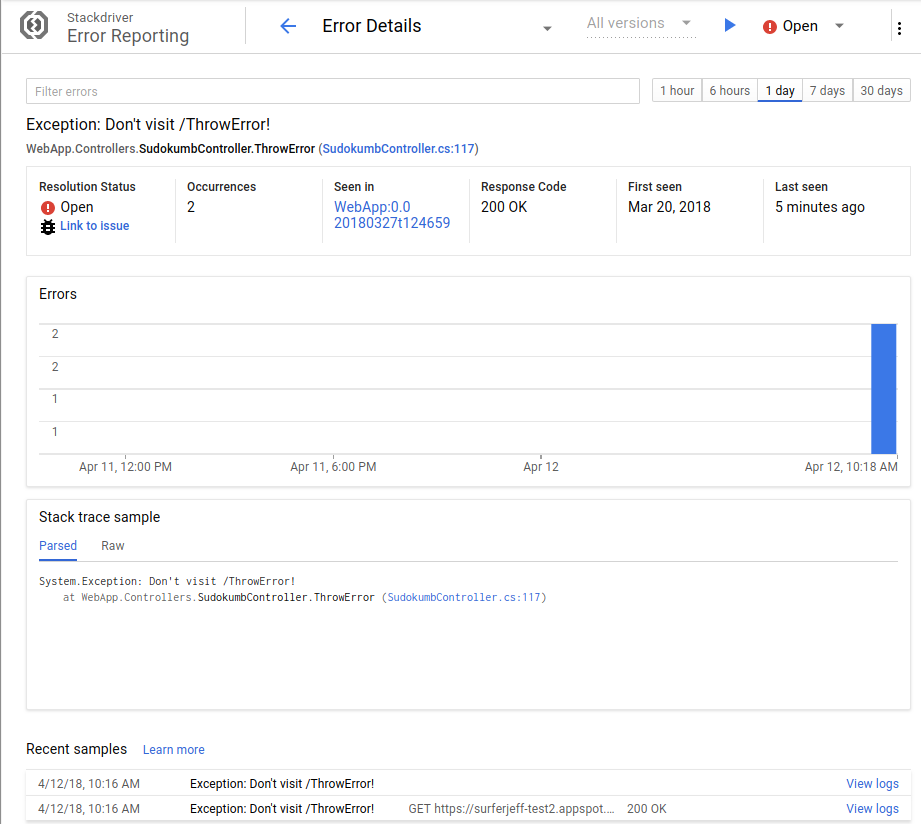
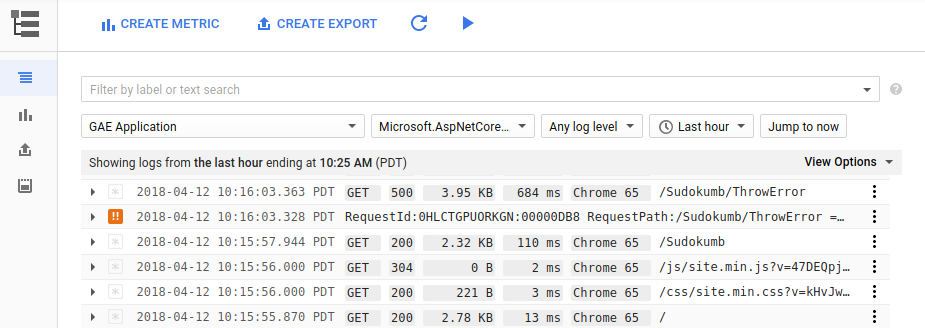
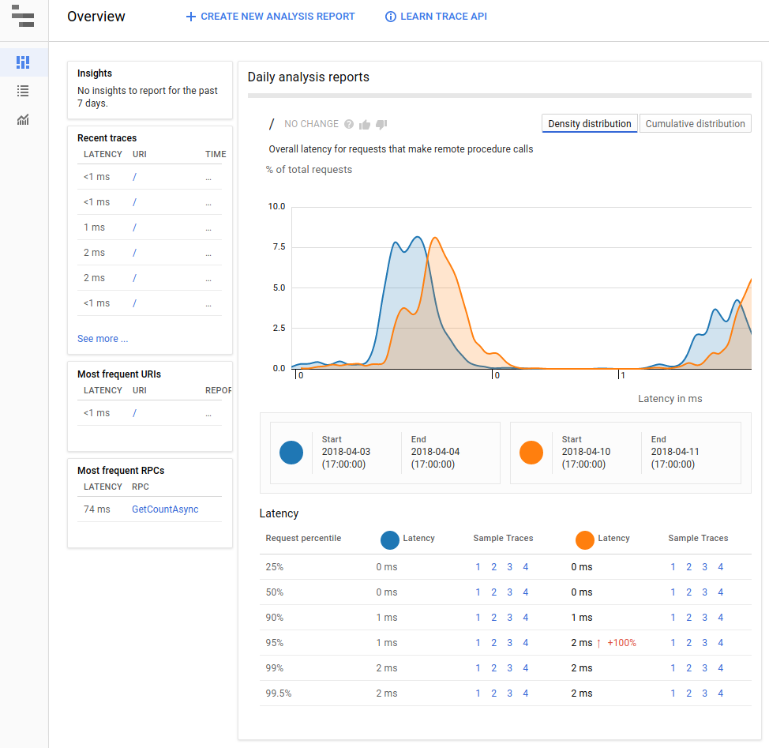

###  Sudokumb logs and reports errors and traces to Stackdriver.

When an exception is thrown in production, critical information for debugging the exception, like the stack trace, is hidden. 

Stackdriver collects details about every exception in a searchable database: 

Stackdriver also collects all your logs into a searchable database:

And stackdriver can show you trace information too:

