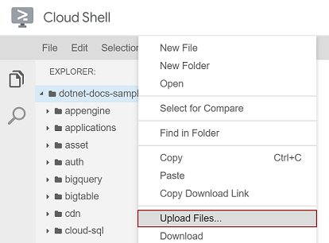

# Google Cloud Speech API Samples

These samples show how to use the [Google Cloud Speech API](http://cloud.google.com/speech)
to transcribe audio files, using the [Google API Client Library for
.NET](https://developers.google.com/api-client-library/dotnet/).

This sample requires [.NET Core 2.0](
    https://www.microsoft.com/net/core) or later.  That means using
[Visual Studio 2017](
    https://www.visualstudio.com/), or the command line.  Visual Studio 2015 users
can use [this older sample](
    https://github.com/GoogleCloudPlatform/dotnet-docs-samples/tree/vs2015/speech/api).

You can also build, run and edit this sample in your web browser using Google Cloud Shell. 
The instructions on how to do this are in the [Build and Run with Google Cloud
Shell](#cloudshell) section below.

## Build and Run

1.  **Follow the set-up instructions in [the documentation](https://cloud.google.com/dotnet/docs/setup).**

4.  Enable APIs for your project.
    [Click here](https://console.cloud.google.com/flows/enableapi?apiid=speech.googleapis.com&showconfirmation=true)
    to visit Cloud Platform Console and enable the Google Cloud Speech API.

9.  From a Powershell command line, run the QuickStart sample:
    ```
    PS C:\...\dotnet-docs-samples\speech\api\QuickStart> dotnet restore
    PS C:\...\dotnet-docs-samples\speech\api\QuickStart> dotnet run
    how old is the Brooklyn Bridge
    ```
    
9.  And run Recognize for more examples:
    ```
    PS C:\...\dotnet-docs-samples\speech\api\Recognize> dotnet restore
    PS C:\...\dotnet-docs-samples\speech\api\Recognize> dotnet run
    Recognize 1.0.0
    Copyright (C) 2017 Recognize

    ERROR(S):
    No verb selected.

    sync            Detects speech in an audio file.

    async           Creates a job to detect speech in an audio file, and waits for the job to complete.

    stream          Detects speech in an audio file by streaming it to the Speech API.

    listen          Detects speech in a microphone input stream.

    rec             Detects speech in an audio file. Supports other file formats.

    sync-creds      Detects speech in an audio file.

    with-context    Detects speech in an audio file. Add additional context on stdin.

    help            Display more information on a specific command.

    version         Display version information.
    
    PS C:\...\dotnet-docs-samples\speech\api\Recognize> dotnet run listen 3
    Speak now.
    test
    testing
    testing one
    testing
     one
    testing
     one two
    testing one
     two
    testing
     1 2 3
    testing 1 2 3
    PS C:\...\dotnet-docs-samples\speech\api\Recognize>
    ```

## <a name="cloudshell"></a>Build and Run with Google Cloud Shell

1.  Follow the instructions in the [root README](https://github.com/GoogleCloudPlatform/dotnet-docs-samples/blob/master/README.md).
1.  Enable APIs for your project. <a target='_blank' href="https://console.cloud.google.com/flows/enableapi?apiid=speech.googleapis.com&showconfirmation=true">Click here</a> to visit Cloud Platform Console and enable the Google Cloud Speech API.
1.  <a target='_blank' href="https://console.cloud.google.com/cloudshell/open?git_repo=https://github.com/GoogleCloudPlatform/dotnet-docs-samples&page=editor&open_in_viewer=README.md&working_dir=speech/api">Open the sample with Cloud Shell</a>.
1.  Upload your JSON key file to Cloud Shell:
    *  Use the Cloud Shell Editor to select the **dotnet-doc-samples** folder.
    *  Use the **File** menu to select **Upload Files...**
    *  Select and upload the JSON key that was downloaded as instructed in the  [root README](https://github.com/GoogleCloudPlatform/dotnet-docs-samples/blob/master/README.md).

    

1.  Set the environment variable `GOOGLE_APPLICATION_CREDENTIALS` to the path of the JSON key that was just imported. In Cloud Shell console, the command will look like this:

    ```
    :~/$ export GOOGLE_APPLICATION_CREDENTIALS=../../../your-project-id-dea9fa230eae3.json
    ```

1. In Cloud Shell console, run the QuickStart sample:

    ```
    :~/dotnet-docs-samples/speech/api$ cd QuickStart
    :~/dotnet-docs-samples/speech/api/QuickStart$ dotnet run
    how old is the Brooklyn Bridge
    ```

1.  And run Recognize for more examples:

    ```
    :~/dotnet-docs-samples/speech/api/QuickStart$ cd ../Recognize
    :~/dotnet-docs-samples/speech/api/Recognize$ dotnet run
    Recognize 1.0.0
    Copyright (C) 2017 Recognize

    ERROR(S):
    No verb selected.

    sync            Detects speech in an audio file.

    async           Creates a job to detect speech in an audio file, and waits for the job to complete.

    stream          Detects speech in an audio file by streaming it to the Speech API.

    listen          Detects speech in a microphone input stream.

    rec             Detects speech in an audio file. Supports other file formats.

    sync-creds      Detects speech in an audio file.

    with-context    Detects speech in an audio file. Add additional context on stdin.

    help            Display more information on a specific command.

    version         Display version information.

    :~/dotnet-docs-samples/speech/api/Recognize$ dotnet run sync ../resources/audio2.raw
    the rain in Spain stays mainly on the plain
    ```

## Contributing changes

* See [CONTRIBUTING.md](../../CONTRIBUTING.md)

## Licensing

* See [LICENSE](../../LICENSE)

## Testing

* See [TESTING.md](../../TESTING.md)
